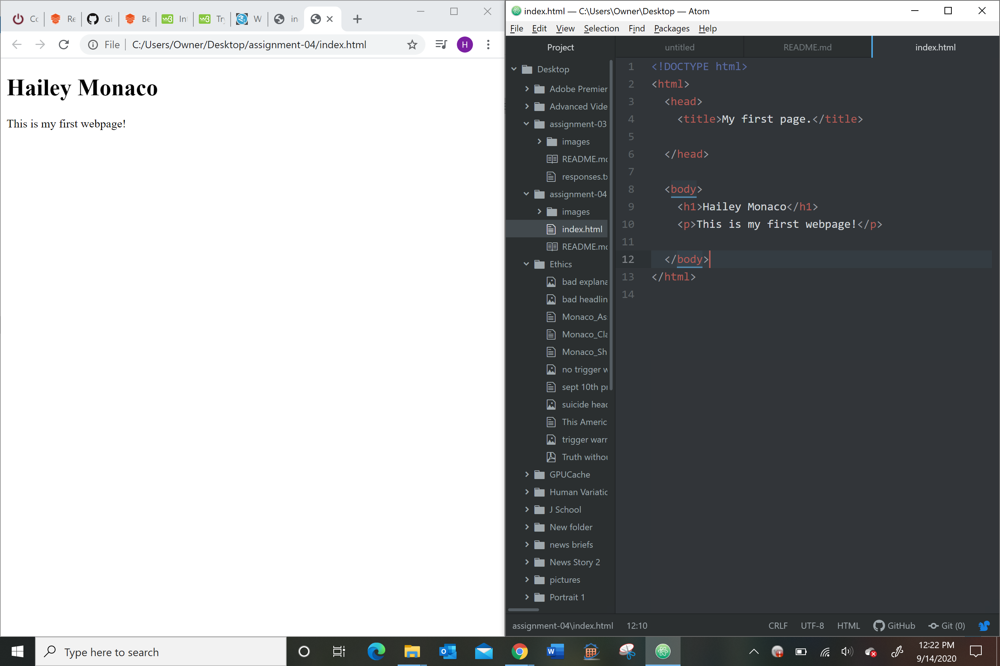

1. When you send a request to the network server, it responds with collection of web content, the browser interprets the content returned and displays the web page. A browser has the user interface, rendering engine, browser engine, communicates over the network to receive content, a JavaScript interpreter, and data storage.
2. Markup language dictates the pages architecture. One commonly used is HTML or HTM, which is the most widely-used web language.

